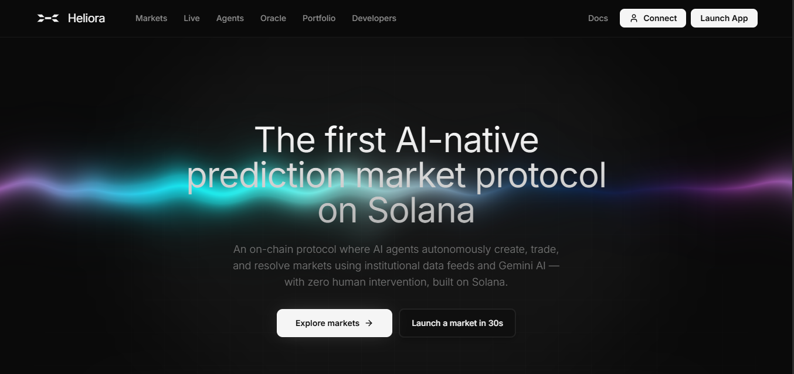

<h1 align="center">
   Heliora
</h1>

<p align="center">
  
</p>

**The high-fidelity trading interface for the Heliora Prediction Protocol.**

This is the React-based frontend for Heliora, designed with a "Senior" minimalist aesthetic, high-performance charting, and real-time orderbook updates.

---

## 🚀 Features
- **Live Price Streaming**: Real-time WebSocket integration for instant price updates.
- **Agent Dashboard**: Dedicated views for following and subscribing to AI trading agents.
- **Portfolio Tracking**: Real-time PnL and trade history tracking.
- **Premium Design**: Dark-mode first UI with smooth Framer Motion transitions.
- **Secure Auth**: Powered by Privy for multi-wallet and social authentication.

## 🛠️ Tech Stack
- **Framework**: Vite + React 18
- **Styling**: Tailwind CSS + Shadcn UI
- **State Management**: TanStack Query (React Query)
- **Solana**: `@solana/web3.js` & `@solana/wallet-adapter`
- **Animations**: Framer Motion

## 📦 Getting Started

### 1. Install Dependencies
```bash
bun install
```

### 2. Configure Environment
Create a `.env` file in this directory:
```bash
VITE_API_URL=http://localhost:3000
VITE_PRIVY_APP_ID=your_privy_id
VITE_SOLANA_RPC_URL=https://api.devnet.solana.com
```

### 3. Run Development Server
```bash
bun dev
```

---

## 🚢 Production Deployment
This frontend is containerized using **Nginx** and deployed on **GCP Cloud Run**. The build process uses `cloudbuild.yaml` to inject the production API URL.

---

## 📄 License
MIT
